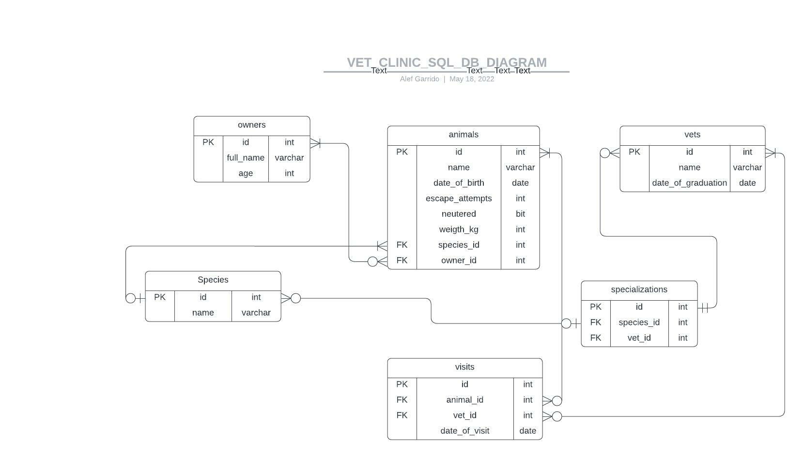

# curriculum-databases-projects-template

>  RDB built using PostgreSQL, themed on a Veterinary Clinic.

## Database schema-Diagram

## Getting Started

### Pre-Requirements
  PostgreSQL installation is needed. Version 14.2 was used for this project.

  - [Official Downloads](https://www.postgresql.org/download)

### Setup

You can run it on your local machine by cloning the project:
- Click on the green "Code" button above.
- Copy the link.
- On your Terminal run `git clone $<LINK>` replacing `$<LINK>` with the link you just copied.
- cd to the folder where you cloned the repo.
- Now you can run the commnads below as needed.

This repository includes files with plain SQL used to recreate a database:

1. Create a DB on your local end

2. Use [schema.sql](./schema.sql) to create all tables. Copy and paste the content of this file into the postgres command line. That should create the tables in your database.
Now verify it. The following command displays all tables in your database:
~~~ postgres
# \d
~~~

3.  Use [data.sql](./data.sql) to populate tables with sample data. Copy and paste the content of this file into the postgres command line. That should create the tables in your database.
Now verify it. The following command displays all content in your selected table:
~~~ postgres
# SELECT * FROM <table_name>;
~~~

4. Check [queries.sql](./queries.sql) for examples of queries that can be run on a newly created database. Copy and paste the content of this file into the postgres command line. That should create the display an enormous list of queries that I prepared. It's recommended to run them individually for better understanding.
**Important note: this file might include queries that make changes in the database (e.g., remove records). Use them responsibly!**

## Authors

👤 Mohamed Eldeeb 

- [GitHub](https://github.com/eng-mohamed-eldeeb)
- [Twitter](https://www.linkedin.com/in/mohamed-eldeeb-a69022206/)
- [LinkedIn](https://twitter.com/eldeeb_3o)

👤 Alef Garrido

- [GitHub](https://github.com/alef-garrido)
- [Twitter](https://twitter.com/Alef_Garrido)
- [LinkedIn](https://www.linkedin.com/in/alef-g/)

## 🤝 Contributing

Contributions, issues, and feature requests are welcome!

Feel free to check the [issues page](../../issues/).

## Show your support

Give a ⭐️ if you like this project!

## Acknowledgments

- Microverse's Curriculum project
- Thanks to all code reviewers
- https://learnsql.com/
- https://www.tutorialspoint.com/sql

## 📝 License

This project is [MIT](./MIT.md) licensed.
